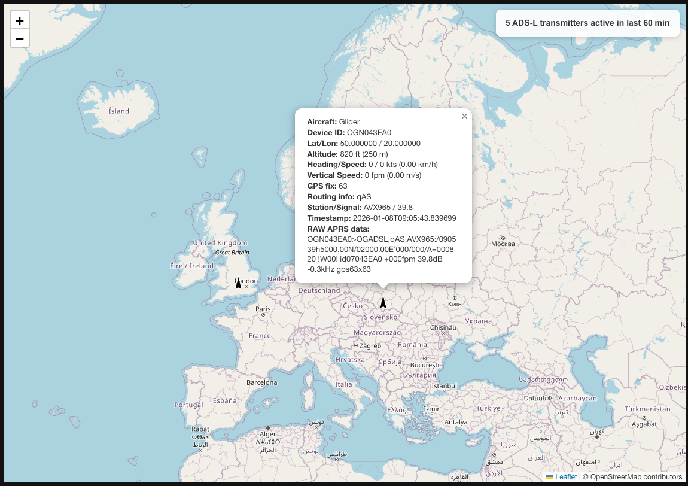
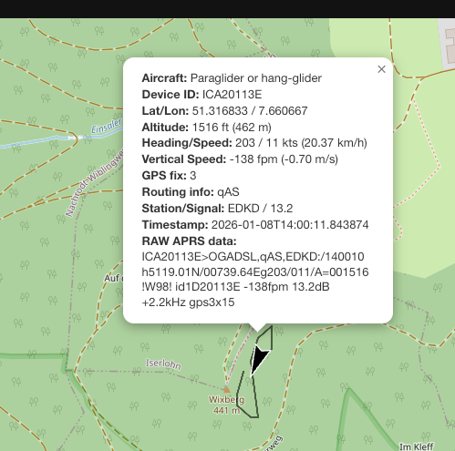
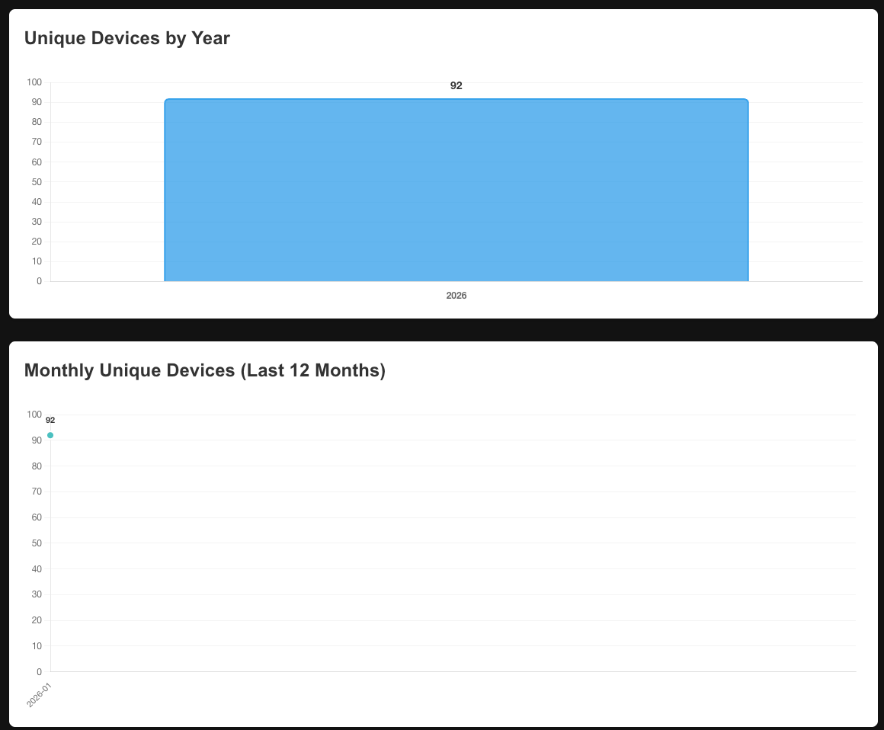

# ec-monitor

The backend of the Electronic Conspicuity Monitor (https://www.saccani.net/conspicuity-monitor/).
It reads the Open Glider Network feed, shows a live map of every conspicuity system it carries, and
measures how well each one keeps light aircraft visible. The rules behind every figure are in
[METHOD.md](METHOD.md); version 1 is the tag `method-v1`, and every later change to the method is a
dated commit. Until 3 October 2026 the project was called `ads-l-map` and only mapped ADS-L devices;
it was moved to this repository with a single commit, and the service, the `/ads-l/` paths and the
`ads_l` database keep the old name.

Data is taken from OGN: https://www.glidernet.org/

## About ADS-L

ADS-L (Automatic Dependent Surveillance – Light) is a tracking system designed for light aircraft, ultralights, paragliders, drones and general aviation operating in non-controlled airspace and inside U-Space. It allows these aircraft to broadcast their position and status, improving situational awareness and safety.

## Project vision

The ADS-L Live Map project aims to provide real-time visibility into the global adoption of ADS-L technology across various aviation segments. By visualizing active devices on an interactive map and tracking historical trends, this project serves as both a monitoring tool for aviation safety and a research resource for understanding ADS-L adoption patterns.

## Key features

- **Real-time Tracking**: Monitor active ADS-L devices worldwide in real time with automatic updates every 5 seconds
- **Historical Analytics**: A chart of the monthly trend in unique device counts
- **Detailed Information**: Access comprehensive aircraft data including position, altitude, speed, heading, vertical speed, GPS fix quality, and signal strength
- **Interactive Interface**: Zoomable map with dynamic marker scaling that adjusts to zoom level for better visualization
- **Device Identification**: Cross-reference with OGN device database for aircraft model and registration information
- **Flight Path Visualization**: View the last 10 positions of each aircraft as black trails showing their flight path
- **Automatic Reconnection**: Persistent connection to OGN feed with automatic reconnection on failure
- **Device Lifecycle Management**: Automatic removal of inactive devices after 60 minutes

### Map Interface Features:

- **Dynamic Aircraft Icons**: Aircraft icons rotate to show heading and scale with zoom level
- **Rich Popups**: Detailed information including raw APRS data for each aircraft
- **Real-time Counter**: Shows number of active ADS-L transmitters in the last 60 minutes
- **Flight Trails**: Black lines showing the last 10 positions of each aircraft
- **Responsive Design**: Adapts to different screen sizes and devices

### Statistics Dashboard:

- **Monthly Chart**: Line chart showing unique devices per month for the last 12 months
- **Interactive Tooltips**: Detailed information on hover
- **Data Labels**: Clear value displays on each data point


## Data sources

This application connects to the Open Glider Network (OGN) APRS data feed, which provides real-time telemetry from ADS-L equipped aircraft worldwide. The device type mapping is sourced from the OGN device database.

## Technical architecture

The application follows a microservice-like architecture with:
- A Flask web server handling HTTP requests
- A persistent TCP connection to the OGN APRS feed with automatic reconnection
- Background threads for data processing and periodic updates
- Optional MySQL database integration for historical statistics
- Automatic pruning of inactive devices (older than 60 minutes)
- Hourly updates of device type mapping from OGN database

### Key Processes:

1. **OGN Feed Connection**: Maintains persistent TCP connection to aprs.glidernet.org:14580 with automatic reconnection every 5 seconds if connection fails
   - Implements periodic keepalive messages every 15 minutes to prevent server timeout
   - Sends "# keepalive" messages to maintain connection stability

2. **Device Management**: 
   - Active devices stored in memory with timestamp
   - Devices inactive for >60 minutes are automatically removed
   - Device type mapping refreshed hourly from OGN device database

3. **Data Processing**:
   - APRS packets parsed for position, altitude, speed, and other telemetry
   - Aircraft type determined from symbol codes or OGN device database
   - Flight trails show last 10 positions of each aircraft

4. **Statistics Collection**:
   - Monthly unique device counts stored in MySQL database
   - Statistics available via API for chart visualization

## Performance considerations

- The application maintains an in-memory cache of active devices
- Old devices (inactive for >60 minutes) are automatically pruned
- Device type mapping is refreshed hourly from the OGN database
- The map interface uses client-side rendering for smooth zooming and panning

## Security

- The application implements proper connection handling with TCP keepalive
- Database connections are secured with environment variables
- All external requests are properly validated and error-handled

## Contributing

Contributions to improve the ADS-L Live Map are welcome! Please:
- Fork the repository
- Create a feature branch
- Submit a pull request with clear documentation

## License

This project is licensed under the MIT License - see the LICENSE file for details.

## Troubleshooting

### Common Issues:

1. **Database connection failed**:
   - Verify MySQL is running: `sudo systemctl status mysql`
   - Check credentials in `.env` file
   - Ensure `monthly_devices` table exists
   - Test connection: `mysql -u [user] -p [database]`

2. **OGN feed connection failed**:
   - Check internet connection
   - Verify port 14580 is not blocked by firewall
   - Test connection: `telnet aprs.glidernet.org 14580`
   - System automatically retries connection every 5 seconds
   - Look for "Sent keepalive message to OGN server" in logs to verify keepalive functionality

3. **No devices displayed**:
   - Verify listener is running (check logs for "OGN connection established")
   - Ensure there are active devices in your area
   - Try refreshing the page after a few minutes
   - Check if devices are being parsed (look for "[PARSED]" in debug logs)

4. **Performance issues**:
   - Increase system memory if handling thousands of devices
   - Ensure sufficient bandwidth for OGN feed (6-700 Kbps recommended)
   - Consider reducing update frequency if needed

### Viewing Logs:
The application uses different log levels:
- `INFO`: General status messages and connection information
- `ERROR`: Connection errors and critical issues
- `DEBUG`: Detailed APRS packet information (disabled by default)

To enable detailed logging:
```bash
gunicorn -w 1 -b 127.0.0.1:5000 --log-level debug app:app
```

Or modify the log level in `app.py`:
```python
main_logger.setLevel(logging.DEBUG)  # Change from INFO to DEBUG
logging.getLogger().setLevel(logging.DEBUG)  # Show RAW/PARSED messages
```

### Debugging Tips:

1. **Check active devices**: Visit `/ads-l/` endpoint to see raw JSON data
2. **Verify database records**: `SELECT COUNT(*) FROM monthly_devices;`
3. **Test device mapping**: Visit `/device-map` to see loaded device types
4. **Monitor connection**: Look for "OGN connection established" in logs
5. **Check pruning**: Verify old devices are removed after 60 minutes

## Contact

For questions or feedback, please open an issue in the GitHub repository.

## Screenshots







## Live deployment

The service runs in production behind https://www.saccani.net/ads-l-real-time-monitoring/, where nginx proxies `/ads-l/` and `/ads-l/stats` to it.

That page is a WordPress page maintained separately from this repository, with its own styling, a stats strip and some context on ADS-L. `templates/map.html` is a simpler standalone demo of the same two endpoints, kept here so that anyone running the service locally has a map to look at. The two are no longer kept in sync, and the demo is not exposed on the public site.

## System Requirements

- Python 3.12+
- MySQL 5.7+ (optional, for statistics)
- Sufficient memory to handle thousands of concurrent device records (100Mb+)
- Sufficient bandwidth to handle the data feed in busy days (6-700 Kbps)

## Metrics

The application tracks and visualizes:
- Number of active devices in the last 60 minutes (displayed in real-time counter)
- Monthly unique device counts for the last 12 months (displayed in line chart with trend visualization)
- Device distribution by type and region
- Flight paths: Black trails showing the last 10 positions of each aircraft


## API Endpoints

`/ads-l/stats`, `/ads-l/sources` and `/ads-l/visibility` also answer `?format=csv`, one flat row per entry (nested fields become `parent.child` columns), for whoever wants to redo the sums in a spreadsheet.

### `/ads-l-map`
**Method:** GET
**Description:** Serves the standalone demo map (`templates/map.html`)
**Usage:** Open in browser to view the interactive map when running locally

### `/ads-l/`
**Method:** GET
**Description:** Returns JSON data of all active ADS-L devices

### `/ads-l/stats`
**Method:** GET
**Description:** Returns one entry per month on record, newest first: `devices` (distinct addresses), `addresses` (the same split by address type: `icao`, `flarm`, `ogn`, `random`, `pilotaware`, `fanet`, `other`), `categories` and `categorised` (aircraft category as declared in the OGN id, recorded only since the `category` column exists), and `partial`, true for the current UTC month. Random addresses change at every power-up or more often, so they overcount devices.

### `/ads-l/live`
**Method:** GET
**Description:** Live positions from the other OGN sources, for the map's layer selector. `?layers=` takes a comma-separated subset of `flarm`, `fanet`, `radio` (other radio systems), `apps` (phone apps), `trackers` (hardware sending over a cellular or satellite link) and `relays` (platforms forwarding other sources, plus unknown internet sources); `&bbox=west,south,east,north` limits the answer to the visible area. ADS-L stays on `/ads-l/`, and ADS-B is not mapped. A device leaves the list 15 minutes after it was last heard.

### `/ads-l/sources`
**Method:** GET
**Description:** Distinct devices per month for every OGN source (the APRS tocall, see `tocalls.txt` in glidernet/ogn-aprs-protocol), split by `via`: `radio` when a ground receiver heard the packet (it carries the receiver's dB and kHz figures, and ADS-B always counts as radio), `net` when an app or platform injected it over the internet. `multi_day` counts devices heard on two different days of the month, which shows whether a source keeps stable ids. Cached for 10 minutes.

### `/ads-l/visibility`
**Method:** GET
**Description:** Daily visibility totals for the last 62 days, per source, channel and aircraft category, as defined in [METHOD.md](METHOD.md): airborne seconds, and the seconds during which the position a receiver could estimate was more than 300 m, 1 km or 3 km from the true one, for the last-point and the packet-based estimator. Also packets, packets carrying a turn rate, segments, session breaks and implausible segments. Cached for 10 minutes.

### `/ads-l/visibility/detail`
**Method:** GET
**Description:** Monthly visibility totals per source, channel, aircraft category, height band above sea (`msl_band`, 0 = below 1,000 m … 4 = above 4,000 m) and above ground (`agl_band`, 0 = below 300 m, 1 = 300–600, 2 = 600–1,200, 3 = 1,200–2,000, 4 = above 2,000; null when outside the terrain model), with a third estimator that ignores the turn rate (`p2_*`) and the same figures restricted to segments that carried a turn rate (`rot_*`) or showed circling (`circ_*`), and the airborne seconds during which the last position was no older than 3, 6, 15 and 30 s (`age_le*`) with the segments no longer than 3 and 6 s (`seg_le*`), and `vanish_2`, `vanish_5`, `vanish_20`, devices silent for more than 2, 5 or 20 minutes after being last seen airborne in that band, and `int_le2` … `int_le64`, airborne segments no longer than 2 … 64 s (the real interval between received packets). See METHOD.md.

### `/ads-l/visibility/grid`
**Method:** GET
**Description:** Monthly visibility per 0.25-degree cell, group of sources and channel, attributed to where the aircraft was last seen; `?month=YYYY-MM`, default the current month. Groups are the map layers plus `adsl`; the extra group `pg` sums paragliders and hang gliders over every source and channel (its `via` column is always `radio` and means nothing), for the share of free flight in cells where apps work (METHOD.md). Until 2026-10-03 trackers and relays were a single `network` group.

### `/ads-l/pattern`
**Method:** GET
**Description:** Radio packets received while the aircraft was circling, by source, aircraft category, distance to the receiving station (`dist_band` 0 = under 5 km, 1 = 5–10, 2 = 10–20, 3 = 20–40, 4 = over 40) and angle between the aircraft's course and the bearing to that station (`sector_deg`, 30-degree sectors). `snr_sum`/`snr_n` give the mean signal-to-noise ratio of those packets corrected for distance (free-space loss), so that the pattern can be read in decibels. Read as the radiation pattern of the installation in flight; see METHOD.md, "How the installation shields the signal".

### `/ads-l/prediction`
**Method:** GET
**Description:** Errors of four predictions of where an aircraft will be 5, 10 and 20 s ahead (straight line, arc from a turn rate the receiver derives from two positions, arc from the transmitted turn rate, last point), by source, category, horizon and circling or straight flight, as counts in error bins (`b0`… with the edges in `bins_m`) plus `n` and `error_sum`. `derived_paired` and `transmitted_paired` hold the same predictions restricted to instants where both exist, which is what the turn-rate comparison reads. See METHOD.md, "Predicting a few seconds ahead".

### `/ads-l/method`
**Method:** GET
**Description:** `METHOD.md` and the history of its commits, read from the deployed checkout (`text`, `commits` with sha, date, title and body, `deployed` commit). Used by the method page, which cannot fetch GitHub itself because the site's Content-Security-Policy limits connections to its own origin. Cached for 10 minutes.

### `/device-map`
**Method:** GET
**Description:** Returns the device type mapping

## Browser Usage

1. **View the Map**:
    - Open your browser and navigate to `http://localhost:5000/ads-l-map`
    - This will display an interactive map showing all active ADS-L devices
    - The map automatically updates every 5 seconds

2. **Access Raw Data**:
    - Visit `http://localhost:5000/ads-l/` to view the JSON data of all devices
    - This is useful for debugging or integrating with other applications
    - Data includes complete telemetry for each active device

3. **View Statistics**:
    - Go to `http://localhost:5000/ads-l/stats` to see monthly device statistics
    - Shows unique devices per month for the last 12 months
    - Used to generate the charts on the main map page

4. **Device Information**:
    - Access `http://localhost:5000/device-map` to view the device type mapping
    - Shows aircraft models and registrations from OGN database
    - Updated hourly from the OGN device database

## Known Issues or Areas of Attention

- **OGN Feed Limitations**: The feed may occasionally stall or disconnect, though the application handles this with automatic reconnection
- **Data Precision**: GPS coordinates have limited precision based on the APRS protocol
- **Geographic Coverage**: Device visibility depends on OGN receiver coverage in each area
- **Device Identification**: Some devices may not be properly identified if not in the OGN database
- **Performance**: Handling thousands of concurrent devices may require additional system resources

## Map Legend

### Aircraft Icons:
- **Black Triangle**: Standard aircraft icon
- **Rotation**: Icon rotates to show current heading
- **Size**: Automatically scales with zoom level (smaller at higher zoom, larger at lower zoom)

### Flight Trails:
- **Black Lines**: Show the last 10 positions of each aircraft
- **Line Thickness**: 2px with 60% opacity for better visibility
- **Update Frequency**: Trails update every 5 seconds along with aircraft positions

### Popup Information:
- **Aircraft Type**: Model and registration from OGN database
- **Position**: Latitude and longitude with 6 decimal precision
- **Altitude**: In feet with metric conversion
- **Speed**: In knots with km/h conversion
- **Vertical Speed**: In fpm with m/s conversion
- **GPS Quality**: Fix quality and satellite count
- **Signal Strength**: In dB
- **Raw Data**: Complete APRS packet for debugging

## Security Considerations

### Database Security:
- Always use strong passwords for MySQL users
- Restrict database user permissions to only what's needed
- Consider using environment variables for sensitive credentials
- Rotate passwords regularly in production environments

### Network Security:
- The application binds to localhost by default (127.0.0.1)
- For remote access, use a reverse proxy with HTTPS
- Consider adding authentication for sensitive endpoints
- Monitor and limit API request rates

### Production Recommendations:
- Run behind a reverse proxy (Nginx, Apache)
- Enable HTTPS with Let's Encrypt
- Implement proper firewall rules
- Monitor system resources and logs
- Set up automatic backups for the database


## Local environment configuration

Local secrets are stored in the .env file in the project folder. This file must be created before running the program
```
DB_USER=database_user
DB_PASSWORD=database_password
SKIP_STATS_DATABASE=False  # Set to True to disable database statistics
```

### Initial Setup

1. **Create MySQL database and user:**
```sql
CREATE DATABASE ads_l;
CREATE USER 'ads_l_user'@'localhost' IDENTIFIED BY 'password';
GRANT ALL PRIVILEGES ON ads_l.* TO 'ads_l_user'@'localhost';
FLUSH PRIVILEGES;
```

2. **Create the statistics table:**
```sql
CREATE TABLE `monthly_devices` (
  `month` char(7) NOT NULL,
  `device_id` varchar(16) NOT NULL,
  `device_type` enum('ADSL','ADSB','FLARM','OTHER') NOT NULL,
  `category` tinyint unsigned DEFAULT NULL,
  `first_seen` datetime NOT NULL,
  PRIMARY KEY (`month`,`device_id`),
  KEY `idx_month_type` (`month`,`device_type`)
) ENGINE=InnoDB DEFAULT CHARSET=utf8mb4 COLLATE=utf8mb4_general_ci
```

```sql
CREATE TABLE `monthly_sources` (
  `month` char(7) NOT NULL,
  `source` varchar(9) NOT NULL,
  `via` enum('radio','net') NOT NULL,
  `device_id` varchar(16) NOT NULL,
  `category` tinyint unsigned DEFAULT NULL,
  `first_seen` datetime NOT NULL,
  `last_seen` datetime NOT NULL,
  PRIMARY KEY (`month`,`source`,`via`,`device_id`)
) ENGINE=InnoDB DEFAULT CHARSET=utf8mb4 COLLATE=utf8mb4_general_ci
```

```sql
CREATE TABLE `daily_visibility` (
  `day` date NOT NULL,
  `source` varchar(9) NOT NULL,
  `via` enum('radio','net') NOT NULL,
  `category` tinyint unsigned NOT NULL,
  `flushed_at` datetime NOT NULL,
  `packets` int unsigned NOT NULL,
  `rot_packets` int unsigned NOT NULL,
  `segments` int unsigned NOT NULL,
  `sessions` int unsigned NOT NULL,
  `implausible` int unsigned NOT NULL,
  `air_seconds` double NOT NULL,
  `p0_300` double NOT NULL, `p0_1000` double NOT NULL, `p0_3000` double NOT NULL,
  `p1_300` double NOT NULL, `p1_1000` double NOT NULL, `p1_3000` double NOT NULL,
  PRIMARY KEY (`day`,`source`,`via`,`category`,`flushed_at`)
) ENGINE=InnoDB DEFAULT CHARSET=utf8mb4 COLLATE=utf8mb4_general_ci
```

```sql
CREATE TABLE `monthly_visibility_detail` (
  `month` char(7) NOT NULL, `source` varchar(9) NOT NULL, `via` enum('radio','net') NOT NULL,
  `category` tinyint unsigned NOT NULL, `msl_band` tinyint unsigned NOT NULL, `agl_band` tinyint unsigned NOT NULL,
  `segments` double NOT NULL DEFAULT 0, `rot_segments` double NOT NULL DEFAULT 0, `circling_segments` double NOT NULL DEFAULT 0,
  `air_seconds` double NOT NULL DEFAULT 0,
  `p0_300` double NOT NULL DEFAULT 0, `p0_1000` double NOT NULL DEFAULT 0, `p0_3000` double NOT NULL DEFAULT 0,
  `p1_300` double NOT NULL DEFAULT 0, `p1_1000` double NOT NULL DEFAULT 0, `p1_3000` double NOT NULL DEFAULT 0,
  `p2_300` double NOT NULL DEFAULT 0, `p2_1000` double NOT NULL DEFAULT 0, `p2_3000` double NOT NULL DEFAULT 0,
  `rot_air` double NOT NULL DEFAULT 0, `rot_p1_300` double NOT NULL DEFAULT 0, `rot_p1_1000` double NOT NULL DEFAULT 0,
  `rot_p2_300` double NOT NULL DEFAULT 0, `rot_p2_1000` double NOT NULL DEFAULT 0,
  `circ_air` double NOT NULL DEFAULT 0, `circ_p1_300` double NOT NULL DEFAULT 0, `circ_p1_1000` double NOT NULL DEFAULT 0,
  `circ_p2_300` double NOT NULL DEFAULT 0, `circ_p2_1000` double NOT NULL DEFAULT 0,
  `age_le3` double NOT NULL DEFAULT 0, `age_le6` double NOT NULL DEFAULT 0, `age_le15` double NOT NULL DEFAULT 0,
  `age_le30` double NOT NULL DEFAULT 0, `seg_le3` double NOT NULL DEFAULT 0, `seg_le6` double NOT NULL DEFAULT 0,
  `vanish_2` double NOT NULL DEFAULT 0, `vanish_5` double NOT NULL DEFAULT 0, `vanish_20` double NOT NULL DEFAULT 0,
  `int_le2` double NOT NULL DEFAULT 0, `int_le4` double NOT NULL DEFAULT 0, `int_le8` double NOT NULL DEFAULT 0,
  `int_le16` double NOT NULL DEFAULT 0, `int_le32` double NOT NULL DEFAULT 0, `int_le64` double NOT NULL DEFAULT 0,
  PRIMARY KEY (`month`,`source`,`via`,`category`,`msl_band`,`agl_band`)
) ENGINE=InnoDB DEFAULT CHARSET=utf8mb4 COLLATE=utf8mb4_general_ci;

CREATE TABLE `monthly_visibility_grid` (
  `month` char(7) NOT NULL, `lat_idx` smallint NOT NULL, `lon_idx` smallint NOT NULL,
  `grp` varchar(8) NOT NULL, `via` enum('radio','net') NOT NULL,
  `segments` double NOT NULL DEFAULT 0, `air_seconds` double NOT NULL DEFAULT 0,
  `p0_300` double NOT NULL DEFAULT 0, `p1_300` double NOT NULL DEFAULT 0, `p1_1000` double NOT NULL DEFAULT 0,
  `p0_1000` double NOT NULL DEFAULT 0,
  PRIMARY KEY (`month`,`lat_idx`,`lon_idx`,`grp`,`via`)
) ENGINE=InnoDB DEFAULT CHARSET=utf8mb4 COLLATE=utf8mb4_general_ci;

CREATE TABLE `monthly_reception_pattern` (
  `month` char(7) NOT NULL, `source` varchar(9) NOT NULL, `category` tinyint unsigned NOT NULL,
  `dist_band` tinyint unsigned NOT NULL, `sector` tinyint unsigned NOT NULL,
  `packets` double NOT NULL DEFAULT 0, `snr_sum` double NOT NULL DEFAULT 0, `snr_n` double NOT NULL DEFAULT 0,
  PRIMARY KEY (`month`,`source`,`category`,`dist_band`,`sector`)
) ENGINE=InnoDB DEFAULT CHARSET=utf8mb4 COLLATE=utf8mb4_general_ci;

CREATE TABLE `monthly_prediction` (
  `month` char(7) NOT NULL, `source` varchar(9) NOT NULL, `category` tinyint unsigned NOT NULL,
  `horizon` tinyint unsigned NOT NULL, `circling` tinyint unsigned NOT NULL, `predictor` varchar(20) NOT NULL,
  `b0` double NOT NULL DEFAULT 0, ... `b13` double NOT NULL DEFAULT 0,
  `n` double NOT NULL DEFAULT 0, `error_sum` double NOT NULL DEFAULT 0,
  PRIMARY KEY (`month`,`source`,`category`,`horizon`,`circling`,`predictor`)
) ENGINE=InnoDB DEFAULT CHARSET=utf8mb4 COLLATE=utf8mb4_general_ci;
```

These four are updated in place (`INSERT … ON DUPLICATE KEY UPDATE`), so the service user needs `UPDATE` on each of them; they hold aggregates only. The terrain model is read from `data/europe_15s.i16` (and the `.json` beside it), or from the path in `ADSL_DEM`; without it, height above ground is recorded as unknown.

`daily_visibility` is append-only: every 15 minutes the service inserts the totals accumulated since the last flush, and readers sum them. Category 255 means unknown.

The service's database user needs `SELECT, INSERT` on the database, `UPDATE (category)` on `monthly_devices` and `UPDATE (last_seen)` on `monthly_sources`, and nothing more. `INSERT ... ON DUPLICATE KEY UPDATE` is deliberately not used: it would need `UPDATE` on every inserted column.

## Running for Testing

To run the application for testing purposes, use the following command:

```bash
gunicorn -w 1 -b 127.0.0.1:5000 --reload --log-level debug --capture-output app:app
```

### Development Mode

For development with automatic reloading:

```bash
export FLASK_APP=app.py
export FLASK_ENV=development
flask run
```

### Viewing Logs

The application uses different log levels:
- `INFO`: General status messages and connection information
- `ERROR`: Connection errors and critical issues
- `DEBUG`: Detailed APRS packet information (disabled by default)

To enable detailed logging, modify the log level in the code or use:
```bash
gunicorn -w 1 -b 127.0.0.1:5000 --log-level debug app:app
```

## Running for Production

For production, you can use systemd to manage the application.

Create a systemd service file (e.g., `/etc/systemd/system/ads-l-map.service`):

```ini
[Unit]
Description=ADS-L Live Map Service
After=network.target

[Service]
User=your_username
Group=your_group
WorkingDirectory=/path/to/ads-l-map
ExecStart=gunicorn -w 1 --threads 2 -k gthread --timeout 0 -b 127.0.0.1:5000 app:app
Restart=always
RestartSec=5
LimitNOFILE=4096

[Install]
WantedBy=multi-user.target
```

Then enable and start the service:

```bash
sudo systemctl enable ads-l-map.service
sudo systemctl start ads-l-map.service
```

## Deploying updates

On the production host the service directory is a git checkout of this repository, and `deploy.sh` moves it to `origin/main`:

```bash
~/ads-l-map/deploy.sh
```

It needs no root. The service runs as the same user, so the script sends SIGHUP to the gunicorn master, which starts a new worker that re-imports `app.py`. If `app.py` does not compile, or the new worker does not answer within a minute, it checks the previous commit out again and reloads that. A reload drops the in-memory list of active devices, which refills within a minute or two as beacons arrive.

Changes to `requirements.txt`, to the systemd unit or to the database schema are not covered and must be applied by hand, a schema change before the code that needs it.

## Python Requirements

Install the required packages using:

```bash
pip install -r requirements.txt
```

If you prefer to use a virtual environment:
```bash
python -m venv venv
source venv/bin/activate
pip install -r requirements.txt
```

Database table for monthly statistics (can be disabled by setting SKIP_STATS_DATABASE to True)
```sql
CREATE TABLE `monthly_devices` (
  `month` char(7) NOT NULL,
  `device_id` varchar(16) NOT NULL,
  `device_type` enum('ADSL','ADSB','FLARM','OTHER') NOT NULL,
  `category` tinyint unsigned DEFAULT NULL,
  `first_seen` datetime NOT NULL,
  PRIMARY KEY (`month`,`device_id`),
  KEY `idx_month_type` (`month`,`device_type`)
) ENGINE=InnoDB DEFAULT CHARSET=utf8mb4 COLLATE=utf8mb4_general_ci
```

```sql
CREATE TABLE `monthly_sources` (
  `month` char(7) NOT NULL,
  `source` varchar(9) NOT NULL,
  `via` enum('radio','net') NOT NULL,
  `device_id` varchar(16) NOT NULL,
  `category` tinyint unsigned DEFAULT NULL,
  `first_seen` datetime NOT NULL,
  `last_seen` datetime NOT NULL,
  PRIMARY KEY (`month`,`source`,`via`,`device_id`)
) ENGINE=InnoDB DEFAULT CHARSET=utf8mb4 COLLATE=utf8mb4_general_ci
```

```sql
CREATE TABLE `daily_visibility` (
  `day` date NOT NULL,
  `source` varchar(9) NOT NULL,
  `via` enum('radio','net') NOT NULL,
  `category` tinyint unsigned NOT NULL,
  `flushed_at` datetime NOT NULL,
  `packets` int unsigned NOT NULL,
  `rot_packets` int unsigned NOT NULL,
  `segments` int unsigned NOT NULL,
  `sessions` int unsigned NOT NULL,
  `implausible` int unsigned NOT NULL,
  `air_seconds` double NOT NULL,
  `p0_300` double NOT NULL, `p0_1000` double NOT NULL, `p0_3000` double NOT NULL,
  `p1_300` double NOT NULL, `p1_1000` double NOT NULL, `p1_3000` double NOT NULL,
  PRIMARY KEY (`day`,`source`,`via`,`category`,`flushed_at`)
) ENGINE=InnoDB DEFAULT CHARSET=utf8mb4 COLLATE=utf8mb4_general_ci
```

`daily_visibility` is append-only: every 15 minutes the service inserts the totals accumulated since the last flush, and readers sum them. Category 255 means unknown.

The service's database user needs `SELECT, INSERT` on the database, `UPDATE (category)` on `monthly_devices` and `UPDATE (last_seen)` on `monthly_sources`, and nothing more. `INSERT ... ON DUPLICATE KEY UPDATE` is deliberately not used: it would need `UPDATE` on every inserted column.

## Acknowledgements

Special thanks to:
- Open Glider Network for providing the data feed
- Contributors to the OGN device database
- EASA and all the people involved in the ADS-L specification
- Europe-Air-Sports (EAS) and European Hang-Gliding and Paragliding Union (EHPU)
- The aviation community for adopting ADS-L technology